# Mermaid 图表代码 - 论文可视化

> 复制下面的代码到 https://mermaid.live 在线生成图表

---

## 图表 1：完整模型架构图

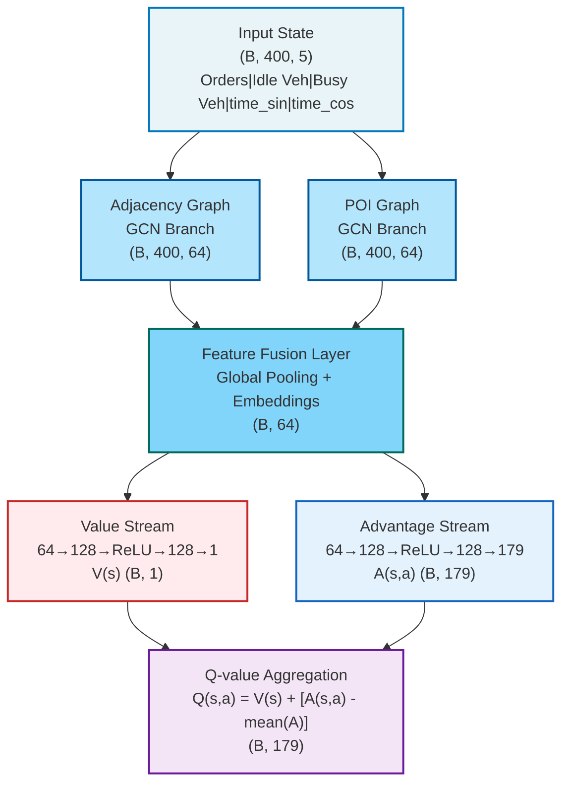

---

## 图表 2：MGCN 详细设计图

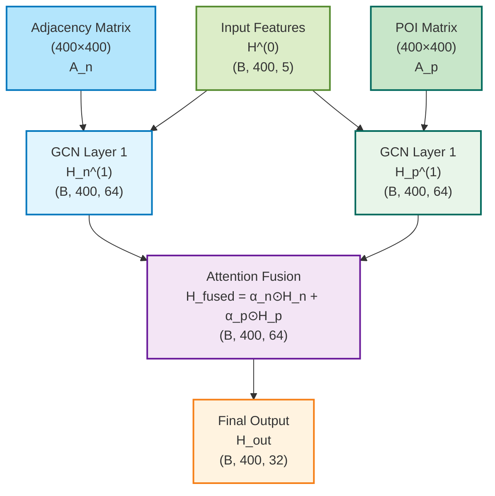

---

## 图表 3：Dueling DQN 架构图

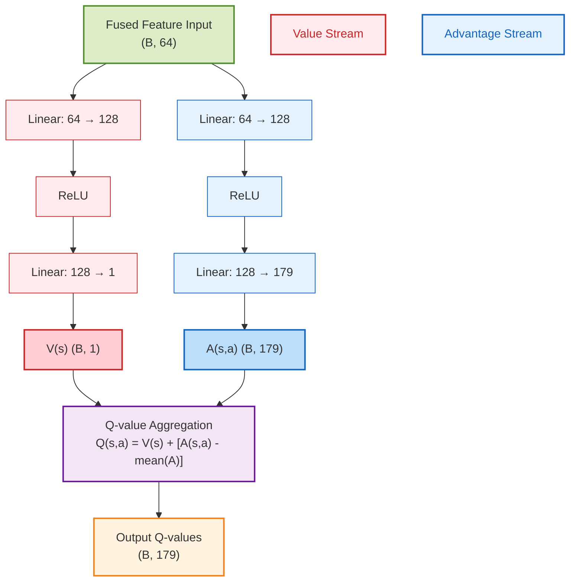

---

## 图表 4：训练循环流程图

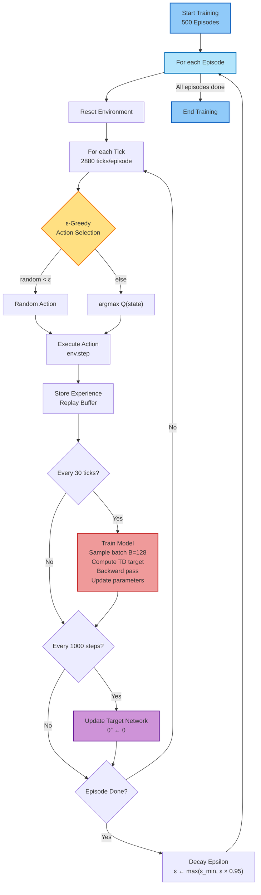

---

## 图表 5：Epsilon 衰减曲线

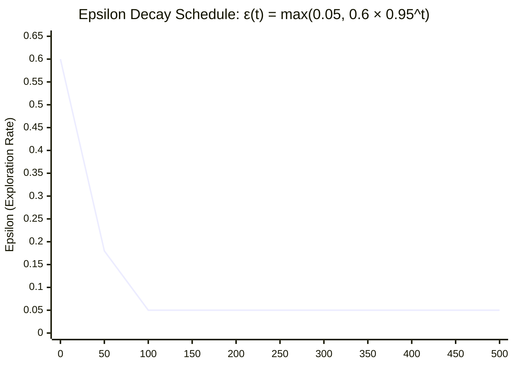

---

## 图表 6：奖励函数曲线

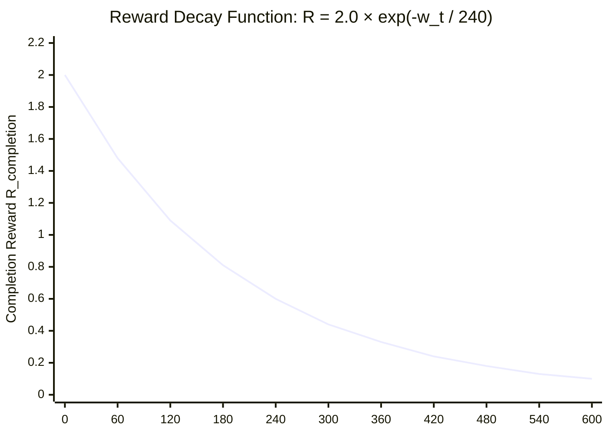

---

## 图表 7：PER 机制流程图

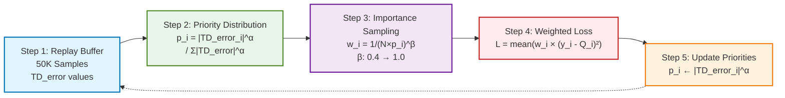

---

## 图表 8：目标网络对比

```mermaid
graph TD
    subgraph without["❌ Without Target Network"]
        A1["Main network θ = [0.5, 0.3, 0.2]"]
        A2["y = r + γ max Q(s', a; θ)"]
        A3["L = (y - Q(s,a;θ))²"]
        A4["Update: θ ← θ - α∇L"]
        A5["Result: θ = [0.48, 0.32, 0.19]"]
        A6["Problem: Moving target!"]
        A7["❌ Unstable Training"]

        A1 --> A2 --> A3 --> A4 --> A5 --> A6 --> A7
    end

    subgraph with["✓ With Target Network"]
        B1["Main θ = [0.5, 0.3, 0.2]<br/>Target θ⁻ = [0.4, 0.25, 0.18]"]
        B2["y = r + γ max Q(s', a; θ⁻)"]
        B3["L = (y - Q(s,a;θ))²"]
        B4["Update: θ ← θ - α∇L"]
        B5["Result: θ changes, θ⁻ fixed"]
        B6["Key: θ⁻ stays fixed!"]
        B7["✓ Stable Training"]
        B8["Update θ⁻ ← θ every 1000 steps"]

        B1 --> B2 --> B3 --> B4 --> B5 --> B6 --> B7 --> B8
    end

    style without fill:#FFEBEE,stroke:#C62828,stroke-width:2px
    style with fill:#E8F5E9,stroke:#00695C,stroke-width:2px
    style A7 fill:#EF5350,stroke:#C62828,stroke-width:2px,color:#fff
    style B7 fill:#66BB6A,stroke:#00695C,stroke-width:2px,color:#fff
```

---

## 图表 9：订单生命周期状态图

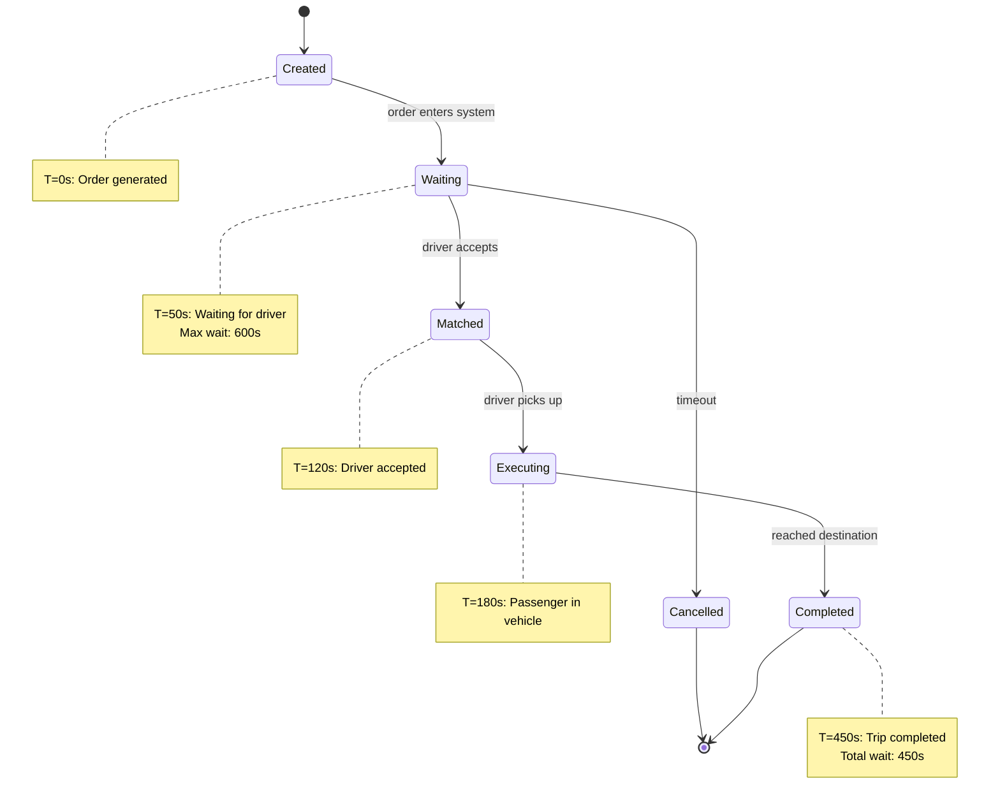

---

## 图表 10：模拟器架构图

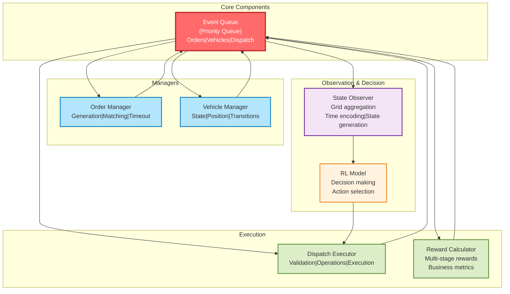

---

## 图表 11：MGCN 多图融合

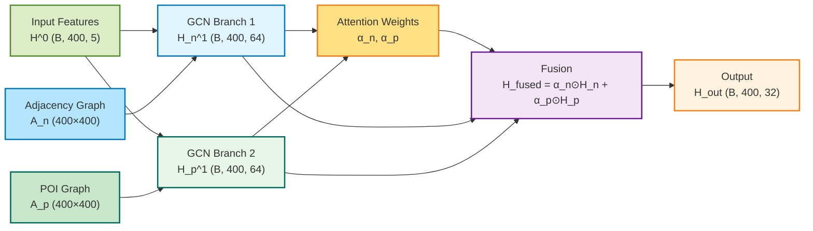

---

## 图表 12：训练指标监控

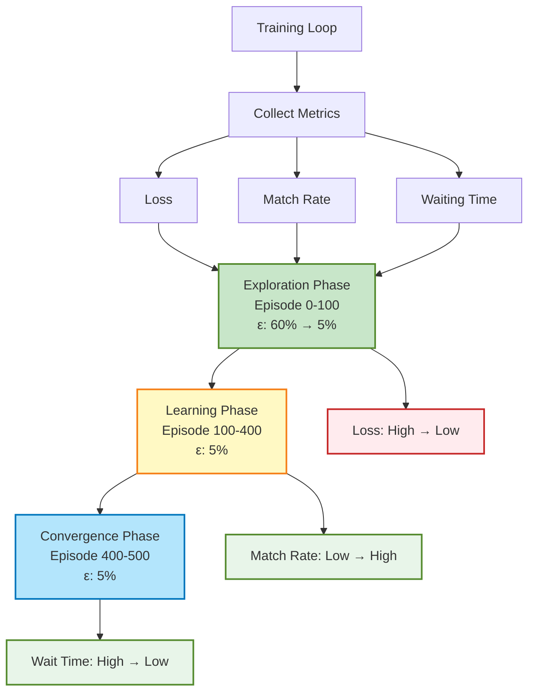

---

## 使用说明

### 在线生成方法：

1. **打开 Mermaid 在线编辑器**
   - 访问 https://mermaid.live

2. **复制上面的代码**
   - 选择你想要的图表代码（从 ``` 到 ```）

3. **粘贴到编辑器**
   - 在左侧代码区粘贴代码

4. **自动生成图表**
   - 右侧会实时显示生成的图表

5. **导出图片**
   - 点击右上角的下载按钮
   - 选择 PNG 或 SVG 格式
   - 保存到本地

### 本地使用方法（如果安装了 Node.js）：

```bash
# 安装 mermaid-cli
npm install -g mermaid-cli

# 生成 PNG 图片
mmdc -i diagram.mmd -o diagram.png

# 生成 SVG 图片
mmdc -i diagram.mmd -o diagram.svg -t dark
```

### 在 Markdown 中使用：

```markdown
\`\`\`mermaid
graph TD
    A --> B
\`\`\`
```

---

## 图表说明

| 图表 | 类型 | 用途 |
|------|------|------|
| 1 | 数据流图 | 展示完整模型架构 |
| 2 | 数据流图 | MGCN 多图卷积网络 |
| 3 | 数据流图 | Dueling DQN 双流架构 |
| 4 | 流程图 | 训练循环完整流程 |
| 5 | 曲线图 | Epsilon 衰减曲线 |
| 6 | 曲线图 | 奖励函数曲线 |
| 7 | 流程图 | PER 优先级回放机制 |
| 8 | 对比图 | 目标网络稳定性 |
| 9 | 状态图 | 订单生命周期 |
| 10 | 架构图 | 模拟器系统架构 |
| 11 | 数据流图 | MGCN 多图融合 |
| 12 | 流程图 | 训练指标监控 |

---

## 自定义建议

### 修改颜色：
```mermaid
style NodeName fill:#新颜色代码,stroke:#边框颜色,stroke-width:2px
```

### 修改文本：
直接编辑引号内的内容

### 修改连接：
```mermaid
A --> B    # 普通箭头
A -.-> B   # 虚线箭头
A ==> B    # 加粗箭头
```

---

## 快速链接

- **Mermaid 官网**：https://mermaid.js.org/
- **在线编辑器**：https://mermaid.live/
- **文档**：https://mermaid.js.org/intro/
- **示例**：https://mermaid.js.org/ecosystem/integrations.html

